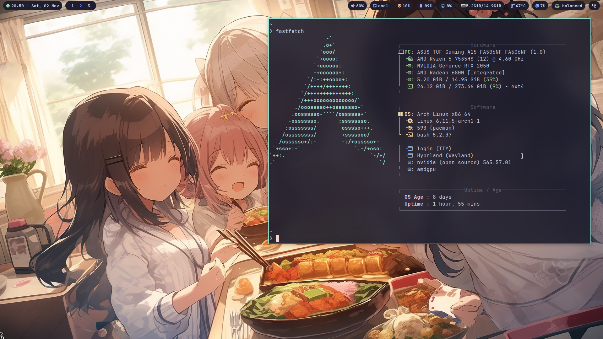

# Arch Linux Hyprland

A customized setup for Arch Linux featuring [Hyprland](https://hyprland.org/), a dynamic tiling Wayland compositor. This setup includes a fully-configured development environment with Neovim, Rofi, Waybar, and more, designed to optimize productivity and aesthetics on a Wayland desktop.

## Screenshots

## Contributing

Since this is my personal configuration, I'm not recommend you to open PRs. You can find something helpful and add it to yours.
